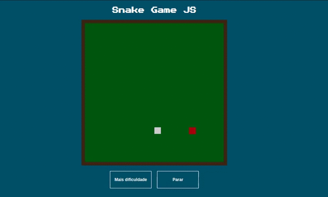

## Snake Game JS :snake:
Projetos simples do famoso jogo da cobrinha usando javascript

### Projeto

### Instalação
<ol>
  <li>Para jogar, basta baixar o repositório do projeto clicando <a href="https://github.com/rodrigoge/snake-game-js/archive/master.zip">aqui</a>.</li>
  <li>Extrair o projeto e executar o arquivo <b>index.html</b>
</ol>

### Para jogar
As setas movem o jogador pelo campo e quanto mais vezes o botão <b>Mais dificuldade</b> for clicado, maior será a velocidade da cobrinha. Para reiniciar o jogo, basta clicar no botão <b>Parar</b> 
